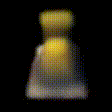
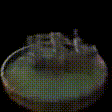

# SfM

## Overview
This part contains the implementation of a Structure from Motion (SFM) pipeline capable of reconstructing 3D structures from a set of 2D images. The project demonstrates various steps involved in SFM, including feature extraction, feature matching, triangulation, and bundle adjustment.

## Prerequisites
- Python 3.7 or above
- OpenCV
- NumPy
- Matplotlib

## Results

-  Feature matching between image pairs.
-  Feature matching between image pairs after RANSAC.
-  The 3D reconstruction from non-linear triangulation.
-  The complete 3D reconstruction representing the culmination of the SFM pipeline.

# NeRF

## Overview
This project implements a NeRF (Neural Radiance Fields) model to create novel view synthesis of 3D scenes from a set of 2D images. It's based on the groundbreaking research that combines deep learning with a volumetric scene representation.

## Prerequisites
- Python 
- PyTorch
- CUDA (for GPU acceleration)

## Results

### Lego with positional encoding

### Lego without positional encoding

### Ship with positional encoding

